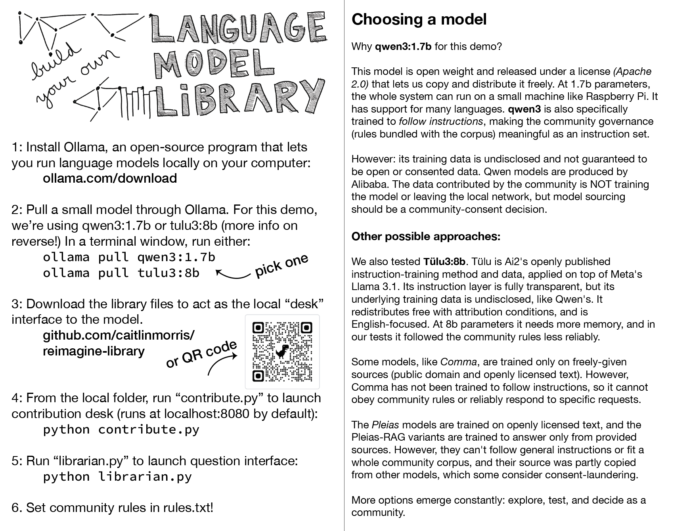

# reimagine-library

Files from a workshop series around using small language models as a community "library".

Most encounters with AI are encounters with a monolith: a sealed system trained on an anonymous mass, where language arrives smoothed of its speakers. Knowledge without a specific knower. This guide to community-oriented small language models comes from a series of workshops, where we asked what the opposite would look like: what it would mean for a community to own its own memory?

A small language model runs locally on a single machine, not connected to the cloud or larger models for training. Instead it reads from a shelf of contributions that stay attributed and deletable — words that remain belonging to someone. Ask it a question and it answers by pointing back to neighbors: Rachel knows this, Anna and Luis disagree about that.  Information is structured to allow it to be inhabited, a reason to find one another rather than a replacement for doing so.

In the associated workshops, participants discussed how these systems might be governed and wrote rules for the language model, while working in a circle, sewing Baudot-coded words into a shared cloth book. Collective making is the oldest setting for collective decision-making, where a group makes community decisions and shares knowledge while its hands are busy. Participants took away a kit for building language models for their own community, but also knowledge about distinctions: between data that is held and data that is absorbed, between rules requested and rules enforced, between a model's fluency and a community's authority over its own words. A library, unlike a monolith, is something a community can walk into and belong in.
